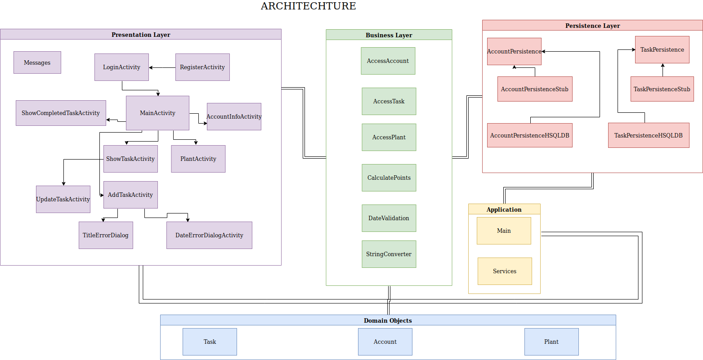

# Architecture

## Diagram

## Presentation Layer
[MainActivity](/app/src/main/java/bruteforce/presentation/MainActivity)
- This file is responsible for the view of the application starting screen.

[AddTaskActivity](/app/src/main/java/bruteforce/presentation/AddTaskActivity)
- This file creates the adding a new task view.

[ShowCompleastedTaskActivity](/app/src/main/java/bruteforce/presentation/ShowCompletedTaskActivity)
- This file creates the showing completed tasks view.

[ShowTaskActivity](/app/src/main/java/bruteforce/presentation/ShowTaskActivity)
- This file creates the list of tasks view

[UpdateTaskActivty](/app/src/main/java/bruteforce/presentation/UpdateTaskActivity)
- This files creates the updating or modifying an existing task view.

[AccountInfoActivity](/app/src/main/java/bruteforce/presentation/AccountInfoActivity)
- Implements the logic for our account info feature, which allows the user to update their account information.

[DateErrorDialog](/app/src/main/java/bruteforce/presentation/DateErrorDialog)
- A dialog that informs the user when there is an invalid date during task creation.

[LoginActivity](/app/src/main/java/bruteforce/presentation/LoginActivity)
- Implements logic for the login page.

[Messages](/app/src/main/java/bruteforce/Presentation/Messages)
- Contains details for error messages.

[PlantActivity](/app/src/main/java/bruteforce/presentation/PlantActivity)
- Implements the logic for the digital plant.

[RegisterActivity](/app/src/main/java/bruteforce/presentation/RegisterActivity)
- Implements the logic for creating a new account.

[TitleErrorDialog](/app/src/main/java/bruteforce/Presentation/TitleErrorDialog)
- Implements a dialog that informs the user they are missing a name for their new task

## Application Layer
[Main](/app/src/main/java/bruteforce/application/Main)
-  Main Method. Runs the initial setup of the application

[Services](/app/src/main/java/bruteforce/application/Services)
- Sets up the databases AccountPersistence and TaskPersistence.

#### [Exceptions](](/app/src/main/java/bruteforce/application/Exceptions)
---
- [ApplicationExceptions](/app/src/main/java/bruteforce/application/Exceptions/ApplicationExceptions)
     - General application Exceptions file. Sets up the required Exceptions.

## Business/Logic Layer
[AccessAccount](/app/src/main/java/bruteforce/business/AccessAccount)
- Business layer logic to access an account in the AccountPersistence. Used to Manipulate an Account object.

[AccessTask](/app/src/main/java/bruteforce/business/AccessTask)
- Business layer logic to access an account in the TaskPersistence. Used to manipulate Task objects.

[CalculatePoints](/app/src/main/java/bruteforce/business/CalculatePoints)
- Business layer logic intended to calculate points when user completes a task.

[DateValidation](/app/src/main/java/bruteforce/business/DataValidation)
- Business layer logic to check for valid date when inserting new task. AddTaskActivity cannot proceed further if it does not pass this test.

[StringConverter](/app/src/main/java/bruteforce/business/StringConverter)
- Business layer logic to convert information received from Task object into astring for display purposes.

[AccessPlant](/app/src/main/java/bruteforce/business/AcessPlant)
- Provides logic for accessing a plant object.

#### [Exceptions](/app/src/main/java/bruteforce/business/Exceptions/)
---
- [AccessingExceptions](/app/src/main/java/bruteforce/business/Exceptions/AccessingExceptions)
    - Genral Business Layer Exceptions.
- [NotLoginExceptions](/app/src/main/java/bruteforce/business/Exceptions/NotLoginExceptions)
    - Exceptions for when there are login errors.

## Persistence Layer
[AccountPersistence](/app/src/main/java/bruteforce/Persistence/AccountPersistence):
- The interface for the accounts in the database

[TaskPersistence](/app/src/main/java/bruteforce/Persistence/TaskPersistence):
- The interface for the list of tasks in the database

#### [HSQLDB]]()
---
- [AccountPersistenceHSQLDB](/app/src/main/java/bruteforce/Persistence/hsqldb/AccountPersistenceHSQLDB)
    - Implements AccountPersistence and connects the app to the Account Database

- [PersistenceException](/app/src/main/java/bruteforce/Persistence/hsqldb/PersistenceException)
    - A class that contains the exceptions relating to Database errors.

- [TaskPersistenceHSQLDB](/app/src/main/java/bruteforce/Persistence/hsqldb/TaskPersistenceHSQLDB)
    - Implements AccountPersistence and connects the app to the Task Database

#### [Stubs]()
---
- [AccountPersistenceStub](/app/src/main/java/bruteforce/Persistence/stubs/AccountPersistenceStub)
    - AccountPersistenceStub implements AccountPersistence and acts as temporary database for the application 

- [TaskPersistenceStub](/app/src/main/java/bruteforce/Persistence/stubs/TaskPersistenceStub)
     - TaskPersistenceStub implements TaskPersistence and acts as temporary database for the application

## Domain Specific Objects
[Account](/app/src/main/java/bruteforce/objects/Account)
-  This class represents a single user account

[Task](/app/src/main/java/bruteforce/objects/Task)
- The object for the task of an account

[Plant](app/src/main/java/bruteforce/objects/Plant)
- The object for the Plant feature of our application

## Docs 

[View other docs](/docs)

