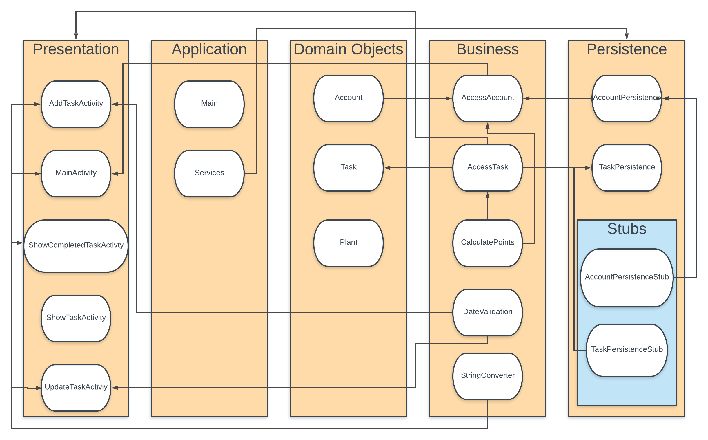

# Architecture

## Diagram

## Presentation Layer
[MainActivity]()
- This file is responsible for the view of the starting screen of the app.

[AddTaskActivity]()
- This file creates the view for adding a new task

[ShowCompletedTaskActivity]()
- This file creates view for showing completed tasks

[ShowTaskActivity]()
- This file creates view for showing list of tasks

[UpdateTaskActivty]()
- This files creates view for updating or modifying existing task

## Application Layer
[Services]()
- Sets up the databases AccountPersistence and TaskPersistence for the application

## Business/Logic Layer
[AccessAccount]()
- Business layer logic to access an account in the AccountPersistence to manipulate Account object

[AccessTask]()
- Business layer logic to access an account in the TaskPersistence to manipulate Task objects

[CalculatePoints]()
- Business layer logic intended to calculate points if task if finished.

[DateValidation]()
- Business layer logic to check for valid date when inserting new task, AddTaskActivity cannot proceed further if it does not pass this test.

[StringConverter]()
- Business layer logic to convert information received from Task object into string and display it 

## Persistence Layer
[AccountPersistence]():
- The interface for the accounts in the database

[TaskPersistence]():
- The interface for the list of for a tasks in the database

[AccountPersistenceStub]()
- AccountPersistenceStub implements AccountPersistence and acts as current database for the application 

[TaskPersistenceStub]()

- TaskPersistenceStub implements TaskPersistence and acts as current database for the application
## Domain Specific Objects
[Account]():
-  This class represents a single user account

[Task]():
- The object for the task of an account

[Plant]():
- The object for the Plant feature of our application

## Docs

[View other docs](docs\)