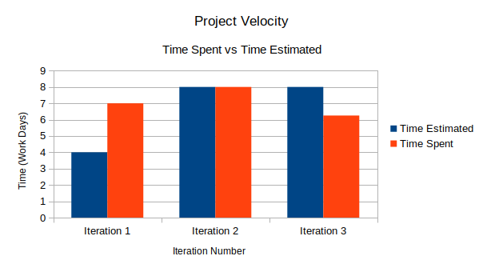

# Final Retrospective on Blossom

This group assignment was, unequivocally, a success. Each member pulled their weight, and everyone was understanding and supportive when others could not be there. Early on, we had strong leadership which resulted in clear programming version control standards, which carried though the various iterations. The version control standards led to relatively smooth introductions to git and version control. The organization of features, user stories, and issues on gitlab proved their worth as we often found ourselves saying "Wait, that's all?" as we approached deadlines. 

A well managed team can still make mistakes, however. In the first iteration we realized we would need a "task ID" to identify various tasks. We implemented a hand wavy solution because we got frustrated with the time spent discussing the issue. We knew it would need to be fixed eventually, but it still caught us off guard in the second iteration. We were unable to deliver a bug free release because we took too long to address this design smell. It caused us database headaches and runtime errors. Eventually, we came up with a fix in the third iteration, but it should have been handled much earlier.
 
We did spend a large portion of our time in the first iteration discussing design, which was frustrating and felt futile, but was also a very good thing. We did most of our work together, which allowed us to have quick discussions about design or bugs. While it might have felt inefficient at first, we realize now that it made the time spent working individually much more productive. Being able to ask a group member what they meant by a comment or working through merge conflicts together was invaluable. We even utilised pair programming later on to great success.

While were all very happy with our work at the end of each iteration, we failed to identify various code smells. We decided that next time, more rigorous code reviews and would be beneficial to the project. We also repeatedly found ourselves running out of time, as we started late. In iteration 2 particularly, we  failed to allocate time to fix any issues that might crop up, and were punished for it with an unfinished product. We did improve on this slightly in the final iteration, as we were more aware of the time needed to complete the tasks and did not commit to more than  we could complete. 

Finally, looking back at our iteration 0, and the vision we had for the product, we definitely overestimated the scope of what features could be added. The plant wilting, or sorting the tasks by tags, or even our stats feature were either pushed to a future release or implemented without much depth. That's not to say that we were not happy with what we accomplished. The plant feature working as intended was a pleasant surprise, as it felt like a daunting feature to complete.

We excelled at managing our tasks, sharing the burden, and communicating with each other. Our time management was lacking, and we should have spent more time with bugs we knew existed. In the end, a was this was successful group project that taught us valuable skills. It's a testament to each member of the group that we can end the semester with by saying "This is fine", and actually mean it. 

 
 